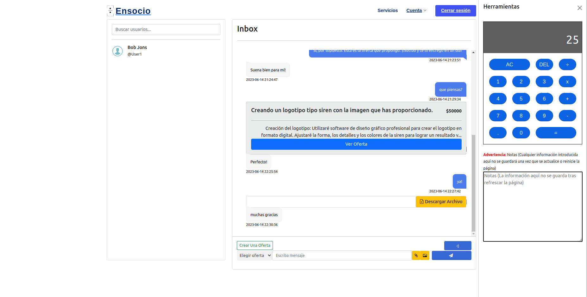
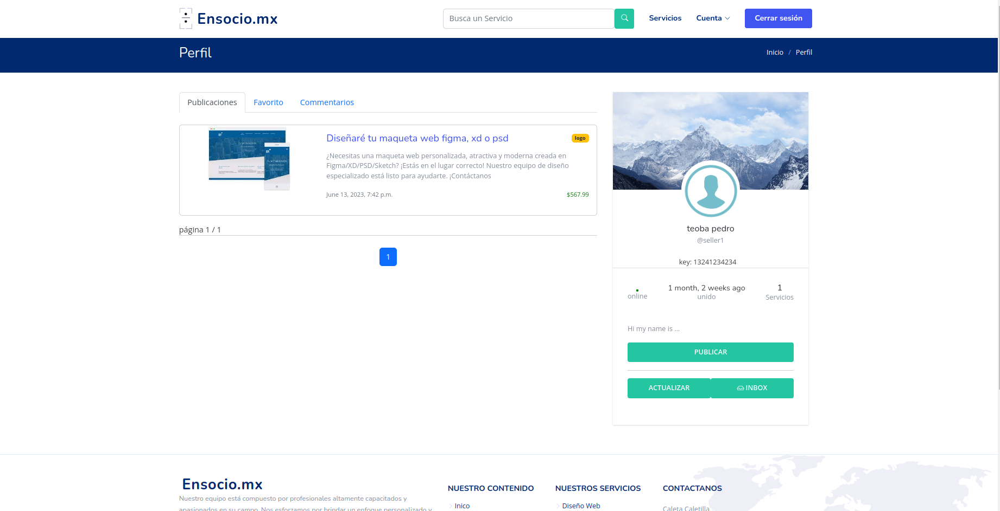

# Ensocio.mx

  

  

  

  

ensocio.mx is a web application inspired by platforms like Fiverr & Upwork. It bridges the gap between freelancers and clients by allowing freelancers to post their services across various categories which the clients can browse and purchase. The application provides a set of communication tools including a comment & reply section, a share feature, profile bios, and a private messaging feature that supports text, files, images, and offers.

## Table of Contents 📘
- [Features](#features-🚀)
- [URL Configuration](#URL-Configuration-🌐)
- [Technologies](#technologies-💻)
- [Installation](#installation-🛠️)
- [For Linux](#for-linux-🐧)
- [For Windows](#for-windows-🪟)
- [Usage](#usage-🖥️)
- [Contributing](#contributing-🤝)
- [License](#license-📜)
- [Models](#Models-📊)

## Features 🚀
- **Home Page**: Users can access the main homepage.
- **Secondary Home Page**: A different version of the homepage accessible at `/inicio/`.
- **User Login & Logout**: Users can log in and log out.
- **Email Login**: Special page for email-based login.
- **Buyer Registration**: Registration page specific to buyers.
- **Seller Registration**: Registration page specific to sellers with an authentication token.
- **Account Deletion**: Users have the option to delete their account.
- **User Profile**: Users have their own profile page.
- **Public Profile Visibility**: Publicly visible profiles of users.
- **Messaging**: Users can send direct messages to each other.
- **Inbox**: Users have an inbox for direct messages.
- **Offers**: Users can create and display offers.
- **Posts**: Users can create, display, edit, and delete posts.
- **Post Interaction**: Users can like, dislike, and comment on posts.
- **Post Favoriting**: Users can mark posts as favorite.
- **Search Functionality**: Users can search for posts, categories, and other users.
- **Category Listings**: Users can view posts in specific categories.
- **Stripe Payment Integration**: Users can create Stripe checkout sessions for payments.
- **Transactions**: Users can view a list of their transactions.
- **Account Activation**: New users need to activate their account through an activation link sent to their email.
- **Password Management**: Users can change and reset their password.
- **Admin Features**: Special features that are only accessible by admins such as viewing specific user conversations.

## URL Configuration 🌐
- **Home**: `'/'` - Main homepage.
- **Inicio**: `'/inicio/'` - Secondary home page.
- **User Login**: `'/user_login/'` - Page for users to log in.
- **Email Login**: `'/email_login/'` - Page for email login.
- **Buyer Register**: `'/buyer_register/'` - Page for buyers to register.
- **Seller Register**: `'/seller_register/SVZOMGHDICY27X5-YWB5LZF2O3KXPSI-KI45BDEYRSQ0LFT-ELOWF93S846ATVQ/'` - Page for sellers to register.
- **User Logout**: `'/user_logout/'` - Endpoint to log out.
- **Delete Account**: `'/delete_account/'` - Page to delete account.
- **Profile**: `'/profile/'` - User profile page.
- **Visible Profile**: `'/visible_profile/<str:username>/'` - Publicly visible profile.
- **Inbox**: `'/inbox/'` - User's inbox for direct messages.
- **Directs**: `'/directs/<str:username>/'` - Direct conversation with a user.
- **Send Message Ajax**: `'/send_message_ajax/'` - Endpoint for sending messages (AJAX).
- **Get Messages Ajax**: `'/get_messages_ajax/<str:username>/'` - Endpoint to retrieve messages (AJAX).
- **Delete Conversation Ajax**: `'/delete_conversation_ajax/<str:username>/'` - Endpoint to delete a conversation (AJAX).
- **Create Offer**: `'/create_offer/<str:username>/'` - Page to create an offer.
- **Display Offer**: `'/display_offer/<int:pk>/'` - Page to display an offer.
- **Create Post**: `'/create_post/'` - Page to create a new post.
- **All Posts**: `'/all_posts/'` - Page showing all posts.
- **Post Detail**: `'/post_detail/<int:pk>/'` - Detailed view of a single post.
- **Like Post**: `'/posts/<int:pk>/like/'` - Endpoint to like a post.
- **Dislike Post**: `'/posts/<int:pk>/dislike/'` - Endpoint to dislike a post.
- **Delete Comment**: `'/comment_delete/<int:pk>/'` - Endpoint to delete a comment.
- **Favorite Post**: `'/post/<int:post_id>/favorite/'` - Endpoint to mark post as favorite.
- **Edit Post**: `'/edit_post/<int:pk>/'` - Page to edit a post.
- **Delete Post**: `'/delete/<int:post_id>/'` - Endpoint to delete a post.
- **Search**: `'/search/'` - Search functionality.
- **Category List**: `'/category_list/<int:pk>'` - Page showing posts in a specific category.
- **Create Checkout Session**: `'/create_checkout_session/<int:pk>/'` - Stripe payment checkout session.
- **Checkout Success**: `'/checkout_success/'` - Page for successful checkout.
- **Checkout Cancel**: `'/checkout_cancel/'` - Page for cancelled checkout.
- **Stripe Webhook**: `'/stripe_webhook/'` - Stripe's webhook endpoint.
- **Transactions**: `'/transactions/'` - Page showing a list of transactions.
- **Activate Account**: `'/activate/<uidb64>/<token>'` - Endpoint to activate account via email.
- **Change Password**: `'/change_password/'` - Page for changing password.
- **Password Changed**: `'/password_changed/'` - Page indicating password has been changed.
- **Password Reset**: `'/password_reset/'` - Page to request password reset.
- **Password Reset Sent**: `'/password_reset_sent/'` - Page indicating password reset email sent.
- **Password Reset Confirm**: `'/reset/<uidb64>/<token>/'` - Page to confirm password reset.
- **Password Reset Complete**: `'/reset_password_complete/'` - Page indicating password reset is complete.
- **Admin Only**: `'/admin_only/'` - Admin only page.
- **Specific User Conversation**: `'/conversation/<str:username1>/<str:username2>/'` - Page showing conversation between two specific users.
- **Admin Search User Conversation**: `'/admin_only_search_user_convo/'` - Admin page to search user conversations.

## Technologies 💻
Ensocio.mx is built with the following technologies:
- [Django](https://www.djangoproject.com/)
- [Python3](https://www.python.org/downloads/)
- [Bootstrap 5](https://getbootstrap.com/docs/5.0/getting-started/introduction/)
- [Stripe](https://stripe.com/mx)
- HTML5
- CSS3
- JavaScript
- [AJAX](https://developer.mozilla.org/en-US/docs/Web/Guide/AJAX)

Requirements TXT
- asgiref==3.6.0
- certifi==2022.12.7
- charset-normalizer==3.1.0
- Django==4.1.7
- django-ckeditor==6.5.1
- django-extensions==3.2.1
- django-jazzmin==2.6.0
- django-js-asset==2.0.0
- gunicorn==20.1.0
- idna==3.4
- Pillow==9.4.0
- pydotplus==2.0.2
- pyparsing==3.0.9
- requests==2.28.2
- six==1.16.0
- sqlparse==0.4.3
- stripe==5.2.0
- urllib3==1.26.14

## Installation 🛠️

### For Linux 🐧

1. Clone this repository
   `git clone https://github.com/SebastianMou/EnsocioBetaV1.git`

2. Change to the repository directory
   `cd EnsocioBetaV1`

3. Create a virtual environment
   `python3 -m venv myenv`

4. Activate the virtual environment
   `source myenv/bin/activate`

5. Install the required dependencies
   `pip install -r requirements.txt`

6. Run the Django migrations
   `python3 manage.py makemigrations && python3 manage.py migrate`

7. Start the Django server
   `python3 manage.py runserver`

### For Windows 🪟

1. Clone this repository
   `git clone https://github.com/SebastianMou/EnsocioBetaV1.git`

2. Change to the repository directory
   `cd EnsocioBetaV1`

3. Create a virtual environment
   `python -m venv myenv`

4. Activate the virtual environment
   `myenv\Scripts\activate`

5. Install the required dependencies
   `pip install -r requirements.txt`

6. Run the Django migrations
   `python manage.py makemigrations && python manage.py migrate`

7. Start the Django server
   `python manage.py runserver`

## Usage 🖥️
1. Visit `localhost:8000` in your browser...
2. Register for an account or login if you already have one.

## Contributing 🤝
Contributions, issues, and feature requests are welcome...

## License 📜
[MIT](https://choosealicense.com/licenses/mit/) License

Copyright (c) [2023] [Sebastián Mauricio Groger Gutiérrez]

Permission is hereby granted, free of charge, to any person obtaining a copy of this software and associated documentation files (the "Software"), to deal in the Software without restriction, including without limitation the rights to use, copy, modify, merge, publish, distribute, sublicense, and/or sell copies of the Software, and to permit persons to whom the Software is furnished to do so, subject to the following conditions:

The above copyright notice and this permission notice shall be included in all copies or substantial portions of the Software.

THE SOFTWARE IS PROVIDED "AS IS", WITHOUT WARRANTY OF ANY KIND, EXPRESS OR IMPLIED, INCLUDING BUT NOT LIMITED TO THE WARRANTIES OF MERCHANTABILITY, FITNESS FOR A PARTICULAR PURPOSE AND NONINFRINGEMENT. IN NO EVENT SHALL THE AUTHORS OR COPYRIGHT HOLDERS BE LIABLE FOR ANY CLAIM, DAMAGES OR OTHER LIABILITY, WHETHER IN AN ACTION OF CONTRACT, TORT OR OTHERWISE, ARISING FROM, OUT OF OR IN CONNECTION WITH THE SOFTWARE OR THE USE OR OTHER DEALINGS IN THE SOFTWARE.

## Models 📊

  

